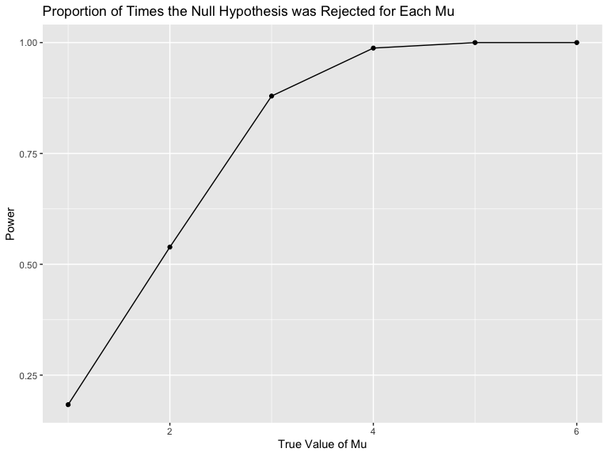
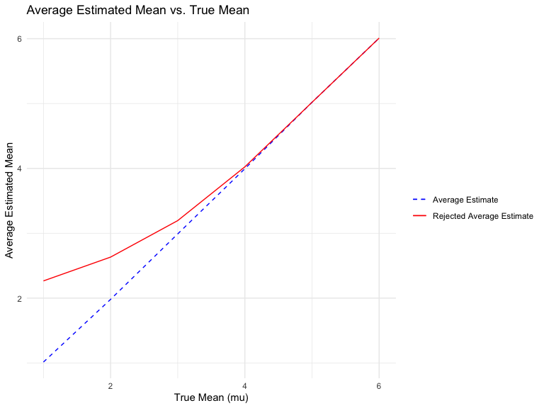

P8105 Homework 5
================
Laylah Jones
2023-11-15

# Problem 1

## Load and clean the dataset

``` r
homicide_df = 
  read_csv("homicide_data/homicide-data.csv", na = c("", "NA", "Unknown"))
```

``` r
homicide_df = 
  read_csv("homicide_data/homicide-data.csv", na = c("", "NA", "Unknown")) %>%
  mutate(
    city_state = str_c(city, state, sep = ", "),
    resolution = case_when(
      disposition == "Closed without arrest" ~ "unsolved",
      disposition == "Open/No arrest" ~ "unsolved",
      disposition == "Closed by arrest" ~ "solved"
    )
  ) %>% 
  filter(city_state != "Philadelphia, PA")
```

The raw dataset has 49142 homicides between 2010 and 2016 and 14
variables that include uid, reported_date, victim_last, victim_first,
victim_race, victim_age, victim_sex, city, state, lat, lon, disposition,
city_state, resolution

``` r
city_homicide_df = 
  homicide_df |> 
  select(city_state, disposition, resolution) |>  
  group_by(city_state) |> 
  summarize(
    hom_total = n(),
    hom_unsolved = sum(resolution == "unsolved"))
```

``` r
atl_test = 
  prop.test(
    x = filter(city_homicide_df, city_state == "Atlanta, GA") %>% pull(hom_unsolved),
    n = filter(city_homicide_df, city_state == "Atlanta, GA") %>% pull(hom_total)) 

broom::tidy(atl_test) %>% 
  knitr::kable(digits = 3)
```

| estimate | statistic | p.value | parameter | conf.low | conf.high | method                                               | alternative |
|---------:|----------:|--------:|----------:|---------:|----------:|:-----------------------------------------------------|:------------|
|    0.383 |    52.493 |       0 |         1 |    0.353 |     0.415 | 1-sample proportions test with continuity correction | two.sided   |

I am focusing only on Atlanta, GA and use the `prop.test` and
`broom::tidy` function to get an estimate and CI of the number of
unsolved homicides.

## Running Prop.Test

``` r
results_df = 
  city_homicide_df |>  
  mutate(
    prop_tests = map2(hom_unsolved, hom_total, \(x, y) prop.test(x = x, n = y)),
    tidy_tests = map(prop_tests, broom::tidy)) |>  
  select(-prop_tests) |>  
  unnest(tidy_tests) |>  
  select(city_state, estimate, conf.low, conf.high) |>  
  mutate(city_state = fct_reorder(city_state, estimate))
```

    ## Warning: There was 1 warning in `mutate()`.
    ## ℹ In argument: `prop_tests = map2(...)`.
    ## Caused by warning in `prop.test()`:
    ## ! Chi-squared approximation may be incorrect

## Plot of Estimates and CIs for Each City

``` r
results_df |> 
  mutate(city_state = fct_reorder(city_state, estimate)) |>  
  ggplot(aes(
    x = city_state, 
    y = estimate)) + 
  geom_point() + 
  geom_errorbar(aes(
    ymin = conf.low, 
    ymax = conf.high)) + 
  theme(axis.text.x = element_text(angle = 90, hjust = 1))
```


This plot shows the rate in which homicides are solved by city. We can
note that Chicago, IL has the highest, from which we can infer that it
is the location of majority of the homicides.

# Problem 2

## Load the data

``` r
study_df = 
  tibble(
    files = list.files("data/"),
    path = str_c("data/", files)) |> 
  mutate(data = map(path, read_csv)) |> 
  unnest(c(data))

study_df
```

    ## # A tibble: 20 × 10
    ##    files      path       week_1 week_2 week_3 week_4 week_5 week_6 week_7 week_8
    ##    <chr>      <chr>       <dbl>  <dbl>  <dbl>  <dbl>  <dbl>  <dbl>  <dbl>  <dbl>
    ##  1 con_01.csv data/con_…   0.2   -1.31   0.66   1.96   0.23   1.09   0.05   1.94
    ##  2 con_02.csv data/con_…   1.13  -0.88   1.07   0.17  -0.83  -0.31   1.58   0.44
    ##  3 con_03.csv data/con_…   1.77   3.11   2.22   3.26   3.31   0.89   1.88   1.01
    ##  4 con_04.csv data/con_…   1.04   3.66   1.22   2.33   1.47   2.7    1.87   1.66
    ##  5 con_05.csv data/con_…   0.47  -0.58  -0.09  -1.37  -0.32  -2.17   0.45   0.48
    ##  6 con_06.csv data/con_…   2.37   2.5    1.59  -0.16   2.08   3.07   0.78   2.35
    ##  7 con_07.csv data/con_…   0.03   1.21   1.13   0.64   0.49  -0.12  -0.07   0.46
    ##  8 con_08.csv data/con_…  -0.08   1.42   0.09   0.36   1.18  -1.16   0.33  -0.44
    ##  9 con_09.csv data/con_…   0.08   1.24   1.44   0.41   0.95   2.75   0.3    0.03
    ## 10 con_10.csv data/con_…   2.14   1.15   2.52   3.44   4.26   0.97   2.73  -0.53
    ## 11 exp_01.csv data/exp_…   3.05   3.67   4.84   5.8    6.33   5.46   6.38   5.91
    ## 12 exp_02.csv data/exp_…  -0.84   2.63   1.64   2.58   1.24   2.32   3.11   3.78
    ## 13 exp_03.csv data/exp_…   2.15   2.08   1.82   2.84   3.36   3.61   3.37   3.74
    ## 14 exp_04.csv data/exp_…  -0.62   2.54   3.78   2.73   4.49   5.82   6      6.49
    ## 15 exp_05.csv data/exp_…   0.7    3.33   5.34   5.57   6.9    6.66   6.24   6.95
    ## 16 exp_06.csv data/exp_…   3.73   4.08   5.4    6.41   4.87   6.09   7.66   5.83
    ## 17 exp_07.csv data/exp_…   1.18   2.35   1.23   1.17   2.02   1.61   3.13   4.88
    ## 18 exp_08.csv data/exp_…   1.37   1.43   1.84   3.6    3.8    4.72   4.68   5.7 
    ## 19 exp_09.csv data/exp_…  -0.4    1.08   2.66   2.7    2.8    2.64   3.51   3.27
    ## 20 exp_10.csv data/exp_…   1.09   2.8    2.8    4.3    2.25   6.57   6.09   4.64

## Tidy the data

``` r
tidy_study_df = 
  study_df |> 
  separate(files, into = c("control_arm", "subject_ID", "csv")) |> 
  mutate(
    control_arm = ifelse(control_arm == "con", "control", control_arm),
    control_arm = ifelse(control_arm == "exp", "experimental", control_arm)
  ) |> 
  pivot_longer(
    cols = starts_with("week"), 
    names_to = "week", 
    names_prefix = "week_",
    values_to = "observation") |> 
  select(subject_ID, control_arm, week, observation) |> 
  mutate(week = as.numeric(week))

tidy_study_df
```

    ## # A tibble: 160 × 4
    ##    subject_ID control_arm  week observation
    ##    <chr>      <chr>       <dbl>       <dbl>
    ##  1 01         control         1        0.2 
    ##  2 01         control         2       -1.31
    ##  3 01         control         3        0.66
    ##  4 01         control         4        1.96
    ##  5 01         control         5        0.23
    ##  6 01         control         6        1.09
    ##  7 01         control         7        0.05
    ##  8 01         control         8        1.94
    ##  9 02         control         1        1.13
    ## 10 02         control         2       -0.88
    ## # ℹ 150 more rows

## Spaghetti Plot of Observations on Each Subject Over Time

``` r
study_plot = 
  tidy_study_df |> 
  ggplot(aes(x = week, y = observation, color = subject_ID)) +
  geom_point() +
  geom_line() +
  facet_grid(.~control_arm) + 
  labs(
    x = "Week",
    y = "Observation",
    title = "Observations for Each Subject by Week"
  )

study_plot
```


The following spaghetti plot shows observations on each subject over 8
weeks. From this plot, we can observe that the control arm had lower
values than the experimental arm. The control arm has observations that
are consistently between the range of approximately -2.17 and 4.26 for
each subject in all eight weeks, with the lowest observation value of
-2.17 in week six for subject 5 and the highest observation value of
4.26 in week five for subject 10. The experimental arm has observations
that are consistently between the range of approximately -0.84 and 7.66
for each subject in all eight weeks, with the lowest observation value
being in week one for subject 2 and the highest observation value being
in week seven for subject 6.

# Problem 3

## Setting the Design Elements and Generating 5000 Datasets

``` r
n = 30
sigma = 5
mu = 0
mus = c(0, 1, 2, 3, 4, 5, 6)
alpha = 0.05
set.seed(12345)
datasets_number = 5000
```

``` r
sim_mean_sd = function(n, mu, sigma) {
  
   rnorm(n, mu, sigma) |> 
      t.test() |> 
      broom::tidy() |> 
      select(estimate, p.value)
}

sim_results =
  expand_grid(
    mu = 0,
    iter = 1:5000
  ) |> 
  mutate(test_result = map(mu, sim_mean_sd, n = 30, sigma = 5)) |> 
  unnest(test_result)

results = 
  tibble(mu = numeric(), mu_hat = numeric(), p_value = numeric(), reject = logical())

sim_results |>
  head() |> 
  knitr::kable(digits = 3)
```

|  mu | iter | estimate | p.value |
|----:|-----:|---------:|--------:|
|   0 |    1 |    0.394 |   0.649 |
|   0 |    2 |    1.558 |   0.195 |
|   0 |    3 |    2.178 |   0.036 |
|   0 |    4 |    0.126 |   0.895 |
|   0 |    5 |   -0.278 |   0.806 |
|   0 |    6 |    0.026 |   0.978 |

``` r
sim_results_2 = 
  expand_grid(
    mu = c(1:6),
    iter = 1:5000
  ) |> 
  mutate(test_result = map(mu, sim_mean_sd, n = 30, sigma = 5)) |> 
  unnest(test_result)
```

## Plot Showing the Proportion of Times the Null was Rejected

``` r
sim_results_2 |>
  group_by(mu) |> 
  summarise(power = sum(p.value < 0.05) / n()) |>
  ggplot(aes(
    x = mu, 
    y = power)) +
  geom_line() +
  geom_point() +
  labs(
    title = "Proportion of Times the Null Hypothesis was Rejected for Each Mu", 
    x = "True Value of Mu", 
    y = "Power")
```



The plot shows a positive association between effect size and power.
From the plot, we can see that as the value of mu increases the
proportion of times the null hypothesis was rejected also increased.
When mu reaches a value of 5 and 6, the power is 1. This could be
interpreted as a larger effect size leading to higher power, meaning a
higher rejection rate.

## Plot Comparing the Average Estimate and the True Value of Mu

``` r
sim_results_2 |> 
  group_by(mu) |> 
  summarise(mean_estimate = mean(estimate)) |> 
  ggplot(aes(
    x = mu, 
    y = mean_estimate)) +
  geom_line(aes(
    color = "Average Estimate", 
    lty = "Average Estimate")) +
  geom_line(data = 
              sim_results_2 |>
              filter(p.value < 0.05) |> 
              group_by(mu) |> 
              summarise(mean_estimate = mean(estimate)),
            aes(color = "Rejected Average Estimate", lty = "Rejected Average Estimate")) +
  scale_color_manual(name = "", values = c("Average Estimate" = "blue", "Rejected Average Estimate" = "red")) +
  scale_linetype_manual(name = "", values = c("Average Estimate" = 2, "Rejected Average Estimate" = 1)) +
  labs(
    title = "Average Estimated Mean vs. True Mean",
    x = "True Mean (mu)",
    y = "Average Estimated Mean",
    color = "mu_hat") +
  theme_minimal()
```



The plot shows that the sample average of the mean (mu) in the tests
where the null hypothesis was rejected is closely approximated to the
true mean (mu). This is demonstrated with the overlay of lines for
average estimate and conditional average estimate. This implies that
when the null hypothesis is rejected, the t-test serves as an unbiased
estimator of the population mean, aligning with the expected
characteristics of the t-test within the specified simulation
conditions.
